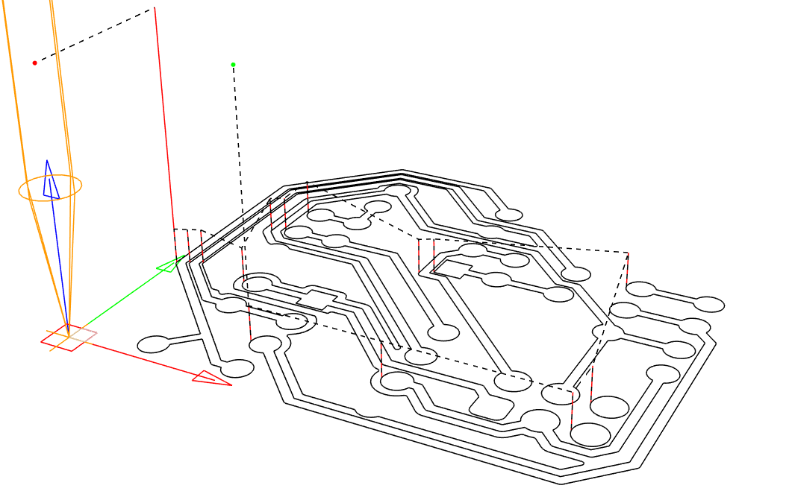
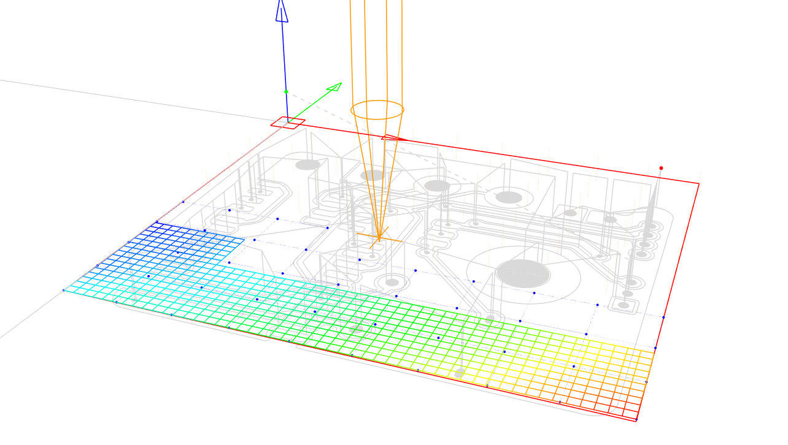
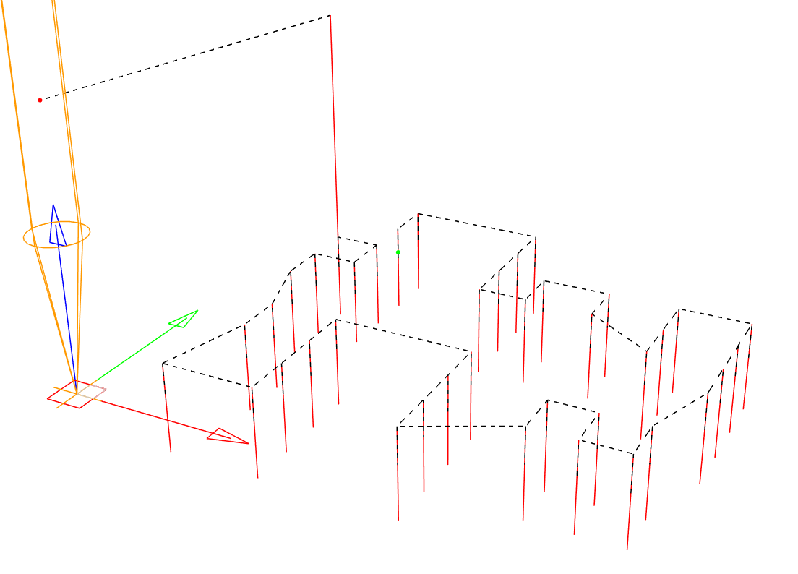
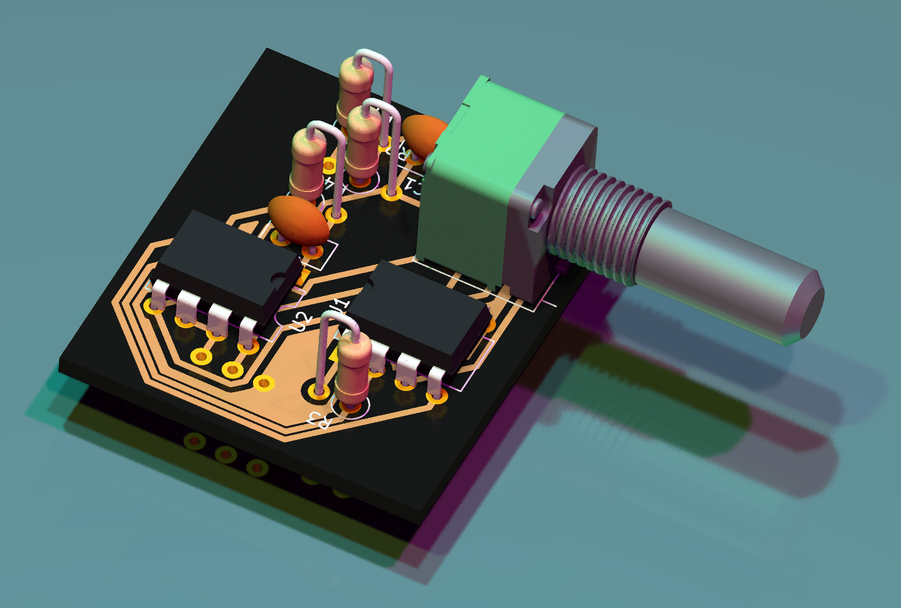

# Using Candle

Candle controls the CNC machine directly over USB or by generating a Gcode file for running on a USB stick inserted in the CNC machine.

* Ensure Candle is connected to the CNC machine over USB by selecting "Service → Settings" and "Connection" in the pop-up window. The "Connection" drop-down should show a numbered COM option corresponding to the CNC machine - if not, verify the correct drivers have been installed.

* Close this window and observe the control panel, which may be configured by adjusting settings.
The 3018 Pro CNC machine is capable of making use of the probe and heightmap functions in Candle, which are critical to producing good quality PCB designs.

* In order to use the continuity probe, where the cutting tool making contact with the PCB surface triggers the probe stop, GRBL commands must be sent to the machine via the command terminal, and the tool head spindle must be connected to a "GND" pin on the control board, and the PCB must be connected to the "A5" pin on the control board. Some 3018 Pro machines shipped with different labelling on the control board - the pins may also be labeled "probe". Both types of control boards are present in the campus labs, so please be aware of this if you use different machines. These connections are easily made using alligator clips and pin headers. These connections must be removed when turning the spindle on - **be sure to always check and check again that these clips are removed from the spindle before turning the spindle on**.

* The GRBL commands that must be sent to properly set the homing cycle for continuity probing are `$22=1` (homing cycle enable) and `$23=0` (homing cycle direction). Additional GRBL commands are provided in the "GRBL_Settings_Pocket_Guide_Rev_B" document or at www.DIYMachining.com/GRBL.

* With the homing cycle configured, spindle off, and clips attached, use the control panel to raise the tool head and position the cutting tool over a corner of the PCB. Note the directionality of all controls, and observe the Candle graphical display of the tool head.

* The Z-probe button may be used to slowly lower the tool head until continuity is made and the tool head stops. Zero the machine in Candle by selecting the Zero X, Y, and Z buttons in the control panel.

* Load the Gcode file generated by FlatCAM by selecting "File → Open". Select the contour CNC job.

  

* Once a Gcode file is opened, Candle enables the Heightmap function. Select "Create" (or optionally apply the modeled heightmap that was developed for rapid prototyping using the fixture design included in this repository).

* Adjust the Heightmap settings to enclose the design shown in the graphical window, or select the "Auto" button to automatically set parameters.

* Select reasonable values for the Heightmap Probe Grid. Some parameters may be unfamiliar - "F" is the probe feedrate, "Zt" is the distance to raise the tool head when moving to the next point, and "Zb" is the distance to lower the tool head when probing. If the machine was zeroed previously, then a value of 1.50 for Zt with other values left as default is likely sufficient.

* Observe the arrangement of the graphical representation of the operation and visually verify that the machine will not crash before selecting "Probe". The routine will run until complete or stop if continuity was made at an unexpected point. If the Heightmap was not able to be completed, try adjusting the "Zt" or "Zb" parameters accordingly, or inspect for other issues, before trying again.

  

* With the Heightmap complete, close the Heightmap mode by selecting "Edit", and select the checkbox "Use Heightmap".

* Raise the tool head slightly and reset alarms if necessary.

* Perform additional visual checks to verify the machine will be able to proceed with the milling operation unobstructed, and **remove clips attached to the spindle and PCB before turning the spindle on**.

***Note that the spindle rotates near 10,000 RPM, and the cutting bit could break and create a dangerous situation. Follow lab policies regarding safety and have faculty or senior students familiar with this process verify that everything is in order before turning on the spindle and running milling Gcode.***

* Turn the spindle on and select "Send" to run the operation. Observe the machine safely and while wearing safety glasses.

* The routine should complete and the PCB will be ready for hole drilling operations. Hole drilling operations should be completed without changing the machine zero positioning, or else alignment will be difficult to achieve accurately. The hole drilling operation should be straightforward so long as the tool bit is changed without losing the machine positioning.

  

The routine should complete and the PCB will be ready for final processing or cutting operations.

  

