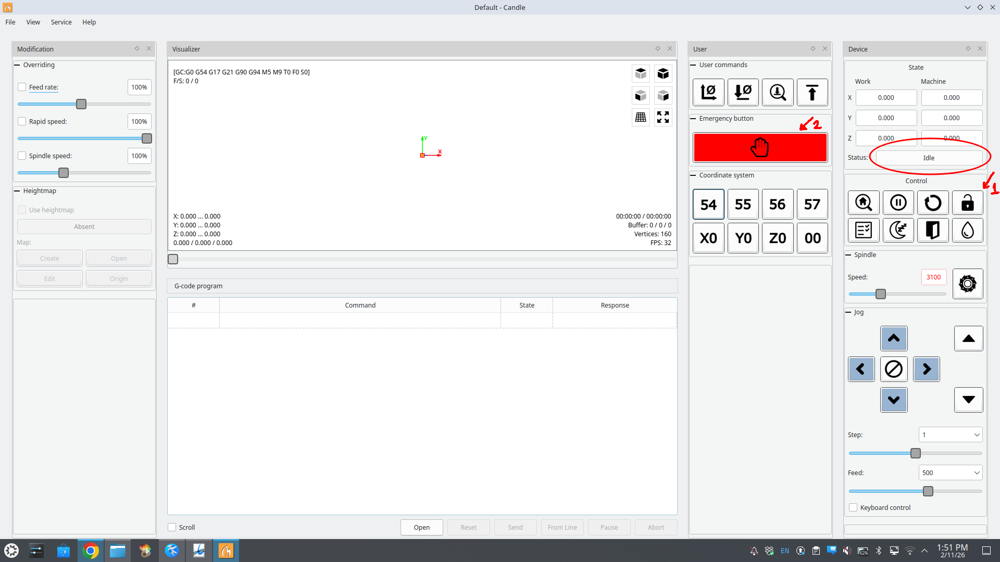
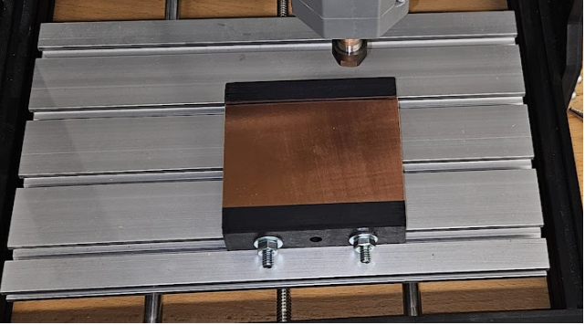
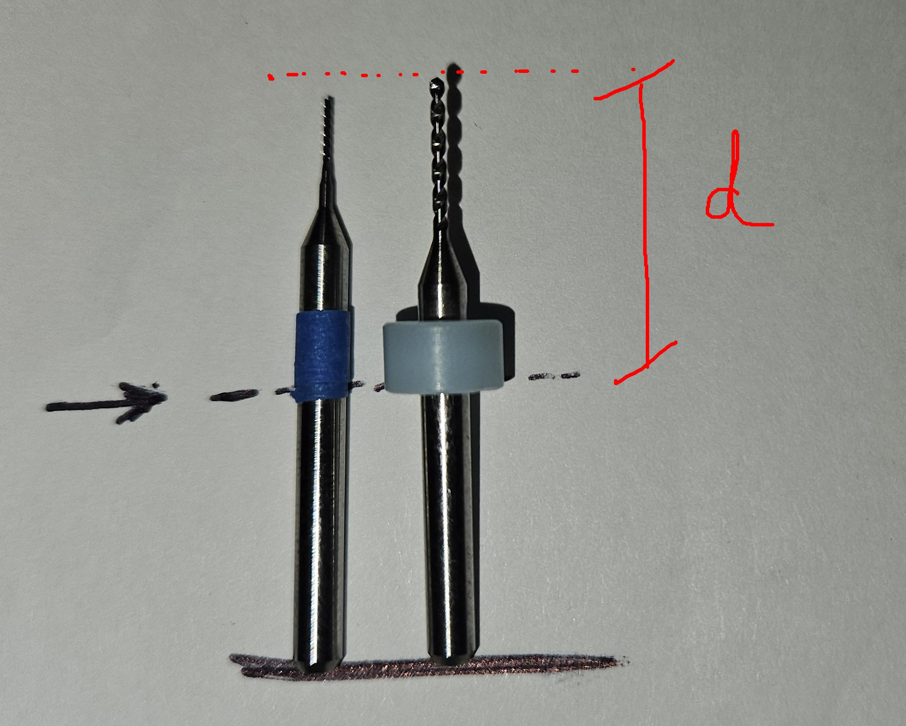
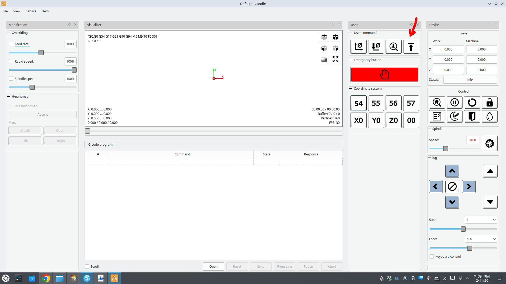
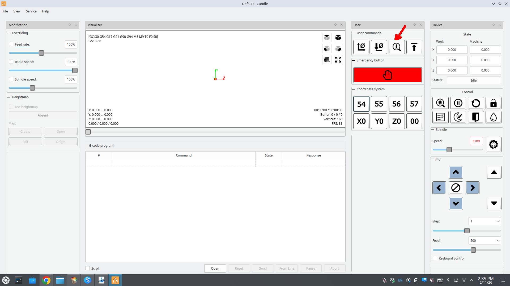
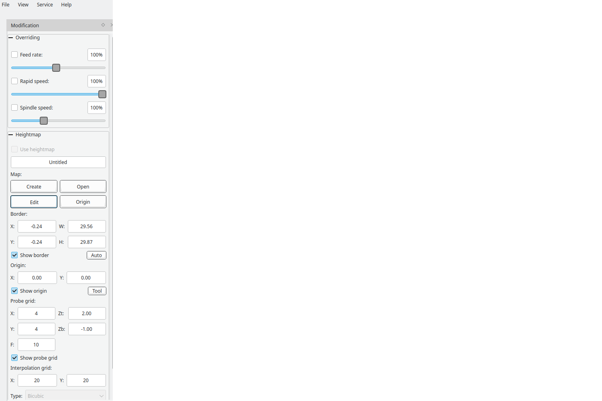

# FlatCAM Tips (for Genmitsu CNC 3018-PRO)

This section provides practical guidelines to reduce common **design and manufacturing issues** when milling PCBs designed in **KiCad** using the **Genmitsu CNC 3018-PRO** CNC machine
([Amazon link](https://www.amazon.com/Genmitsu-3018-PRO-Control-Engraving-300x180x45mm/dp/B07P6K9BL3)).

<p align="center">
  
</p>

The **Genmitsu CNC 3018-PRO** is an entry-level, desktop, 3-axis CNC router intended for hobbyists, students, and educational environments. It has a working area of approximately **300 × 180 × 45 mm**, uses a 775 spindle motor, and is controlled via **GRBL firmware**.

The machine is commonly used for engraving and light milling of materials such as wood, plastics, acrylic, **PCB copper boards**, and soft aluminum. While affordable and relatively easy to assemble, it is designed for **prototyping and learning**, not industrial-grade PCB manufacturing.

Although the machine offers reasonable precision, PCB milling imposes strict constraints on **trace width, clearance, pad size, and tool depth**. Inadequate settings can easily result in short circuits, broken traces, incomplete isolation, or partially milled pads.

---

# Safety Notes

- Always wear **eye protection**
- Never touch the tool while the spindle is running
- Keep hands away from moving parts

<p align="center">
  
</p>

---


# Candle Guidelines for CNC Milling

From **FlatCAM**, three G-code files must be generated:

- `'name'_MILLING_0.075.nc`
  — Used in **Candle** to mill (isolate) the copper traces

- `'name'_DRILLING_0.075.nc`
  — Used in **Candle** to mark the hole centers

- `'name'_DRILLING_2.5.nc`
  — Used in **Candle** to drill the holes through the board

---

# Installing Candle

Download Candle

On Linux, you may need to run:

```bash
sudo ./candle
```

---

# Required Items for This Activity

<p align="center">
  
</p>

- Genmitsu CNC 3018-PRO
- 3D-printable fixture
- USB cable
- Power supply
- Phenolic copper clad board (approx. 10 × 8 cm)
- Milling bit (0.5 mm recommended)
- Drill bit (1.0 mm recommended)
- Z-probe wires (green and white)


---

# Preparing the CNC Machine

- Plug the USB cable into the computer (**do not turn on the CNC machine yet**)
- Open Candle:
  ```bash
  sudo ./candle
  ```

- Ensure the status shows **"Idle"**
  - If not: `Service → Settings → Port`

- Click the **lock button** to unlock the machine
- Press the **emergency button** (so the machine does not move when powered)

<p align="center">
  
</p>

- Plug the CNC machine into the power outlet
  - The machine should NOT move

- Close and Restart Candle

- Ensure status is **Idle**

- Unlock the machine

- You can now move the axes using Candle controls

- Move the spindle to one corner of the machine
  - **Do not exceed machine limits**

- Install the board holder system

<p align="center">
  
</p>

- Place the **phenolic copper clad sheet (10 × 8 cm)**

<p align="center">
  
</p>

---

# Preparing the Tools

To maintain consistent tool height, mark both tools at the same reference height.

### Tools

- **Milling tool:**
  0.5 mm carbide end mill (1/8" shank)

- **Drilling tool:**
  1.0 mm tungsten carbide PCB drill bit (1/8" shank)

<p align="center">
  
</p>

- Install the **milling tool** first

---

# Setting the XY Reference (Origin)

- Close and Restart Candle

- Ensure status is **Idle**

- Unlock the CNC machine

- Move the spindle to the **bottom-left corner of the copper board**

<p align="center">
  
</p>

- Set this position as **X = 0, Y = 0**

<p align="center">
  
</p>

- Close and Restart Candle

- Ensure status is **Idle**

- Unlock the CNC machine

- Set this position as **X = 0, Y = 0** again

- Load the milling file:
  `'name'_MILLING_0.075.nc`

- Set **Safe Z**

⚠ **If the spindle moves unexpectedly, immediately turn off the machine.**

<p align="center">
  
</p>


---

# Setting the Z-Probe

Before probing:

- Ensure the two probe cables are connected properly

<p align="center">
  
</p>

- For this setup:
  - **White cable → spindle motor**
  - **Green cable → copper board**

<p align="center">
  
</p>

⚠ **WARNING:**
Improper connection may damage the board or tool.

- Click **PROBE Z**

<p align="center">
  
</p>

---

# Creating the Heightmap

- Click **Create**
- Click **Auto** (covers only the board area)
- Set:
  - **Zt = 2** (safe probing height)
  - **Zb = -1** (maximum probing depth)

<p align="center">
  
</p>

- Click **PROBE**
- When finished, click **EDIT** to return to the main screen

⚠ **Disconnect the white and green probe wires before proceeding**

---

# Using the Heightmap

- Enable **Use Heightmap**

- Set spindle speed (**FEED**) to **3000 rpm**

⚠ Double-check that probe wires are disconnected

- Click **SEND**

The milling process will now begin using surface compensation from the heightmap.

---


