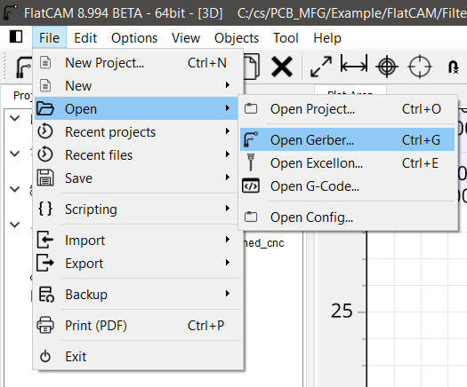
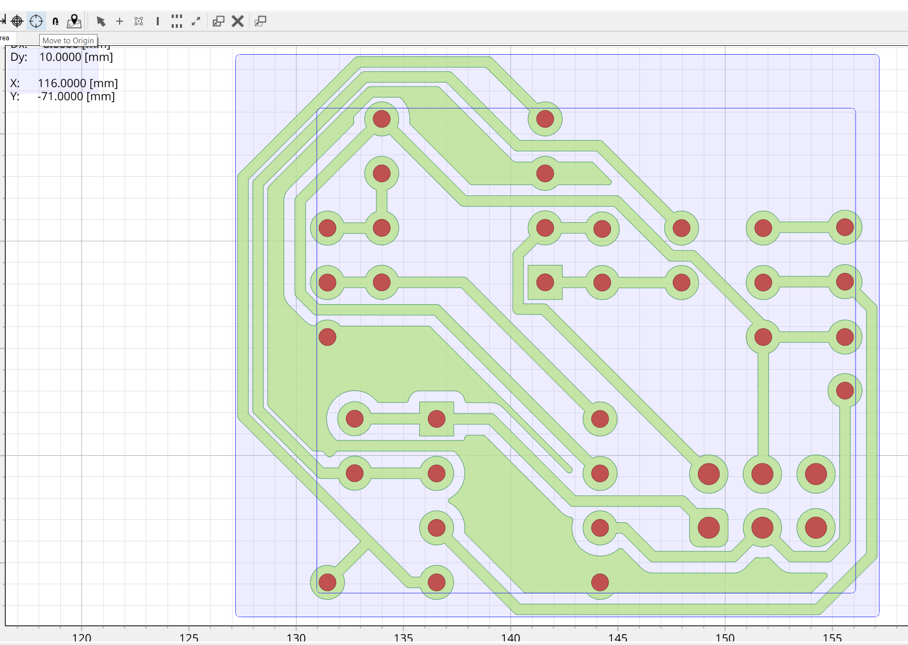
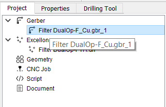
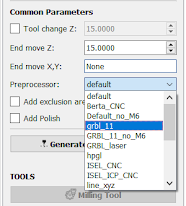
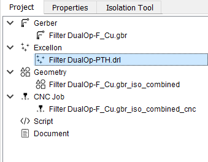
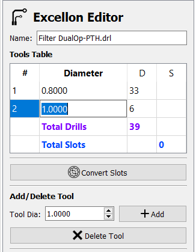
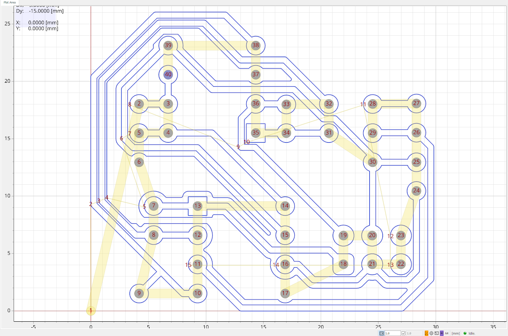

# FlatCAM

* In FlatCAM, open the Gerber and the Excellon files to add them to the FlatCAM project.

  

* These objects may be placed far from the origin, so select all using the "Ctrl + A" shortcut, and Move to Origin using the "Shift + O" shortcut. It is important to select all objects to move them as a group, otherwise the drill objects will not be aligned to the contour objects.

  

## Generating Trace GCode

* Double-click the Gerber in the project tree side panel, then select "Isolation Routing".

  

* Right click the #1 tool in the Tools Table and delete it. We must set up a new tool to mill at the 0.1mm depth of cut using the lab's V-cutter bits.

* Use the "Ctrl + D" shortcut to open the Tools Database. You may create a new tool here, but it is recommended to import the database provided in this repository. Select "Import DB" and select the [Tools_Data_Base.TXT](../FlatCam_Tools_Database/Tools_Data_Base.TXT) file to import the V-cutter tool.

* Select "Pick from DB" in the sidebar, select the "V-Cutter" tool, and select "Transfer the Tool" to apply to the Isolation Tool operation.

* Change "Tool Dia." to match the 0.0354 diameter, and select "Generate Geometry".

* Change the Preprocessor to 'grbl_11_no_M6', followed by "Generate CNCJob Object".

  

* The contour job is complete, select "Save CNC Code" or right click the CNC Job in the project tree side panel to save the Gcode for access with Candle later.

## Generating Drill GCode

* The drill job can now be created. This operation may vary depending on your requirements. For example, the provided design uses two different size vias, and these can either be combined to one size or retained as two different drill operations. Depending on drill bit availability and prototyping requirements, you may opt to simplify this operation to use the smallest size drill, otherwise it is recommended to use the Tool Change option to provide for drill changing.

* Double click the Excellon drill file in the project tree side panel, and select "Excellon Editor" to make changes to the drills this operation will apply to. For example, edit all sizes to the same value to combine drills.

  

  

* Exit the editor and save changes. Select "Drilling Tool" and edit parameters accordingly. Since this is a separate operation from the contour, it will be critical that the CNC machine retains its positioning to ensure alignment. Keep this in mind when setting parameters for tool changes, if this option is selected.

* It is recommended to reduce Feedrate Z to 60 (300 may be too high and could cause damage to the board). Adjust Cut Z to a value that will completely drill through the board. If using the provided fixture, there will be ample clearance under the board.

* Select "Generate CNCJob Object" and save in the same manner as the contour operation.

  

These Gcode files may be opened directly in Candle for heightmap generation and running the machine.

Next Tutorial: [Using Candle](./using_Candle.md)
