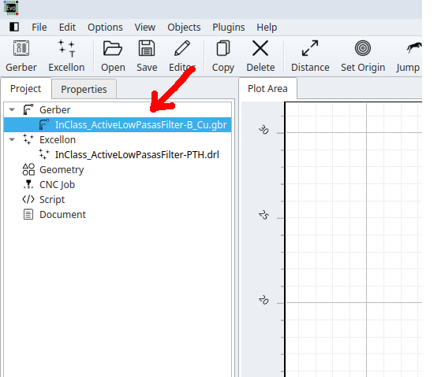
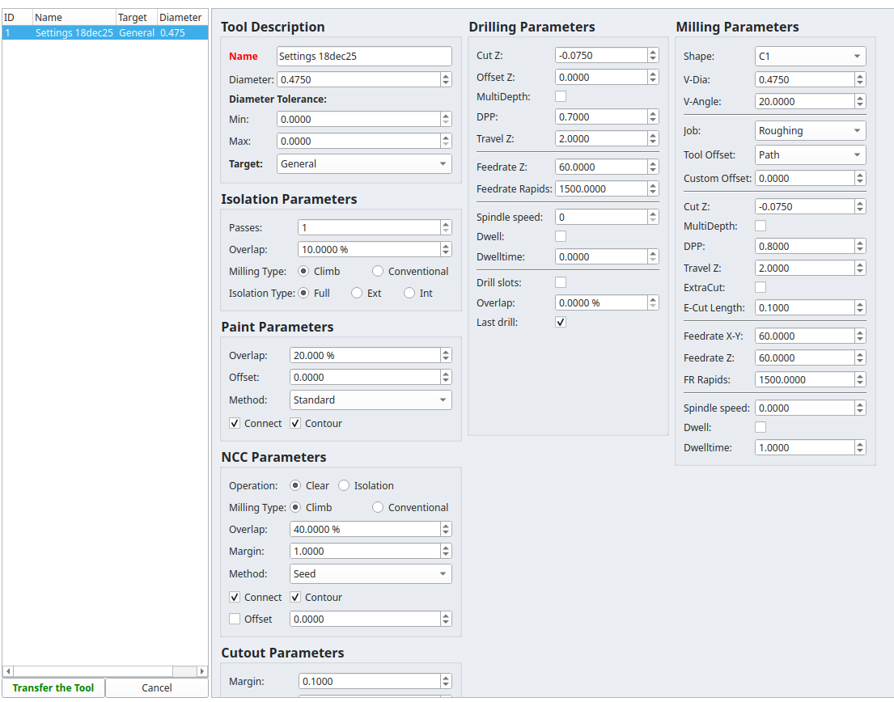
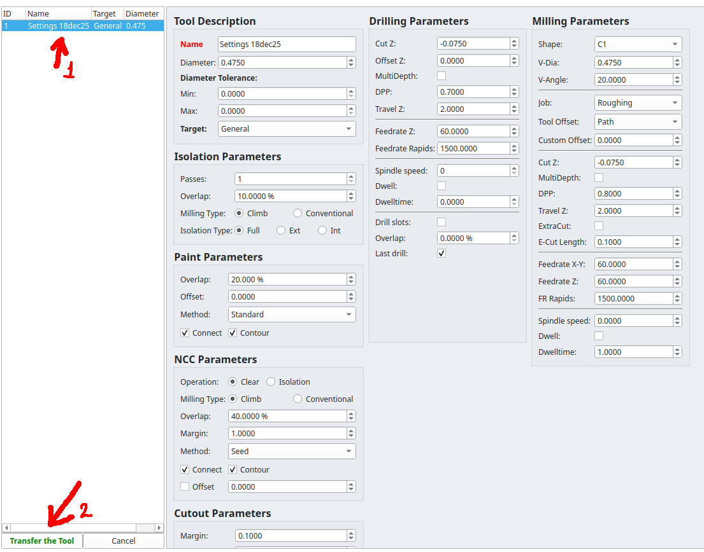
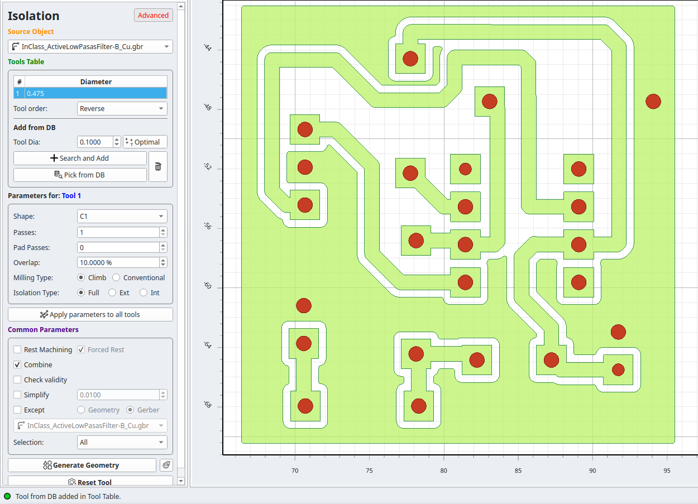
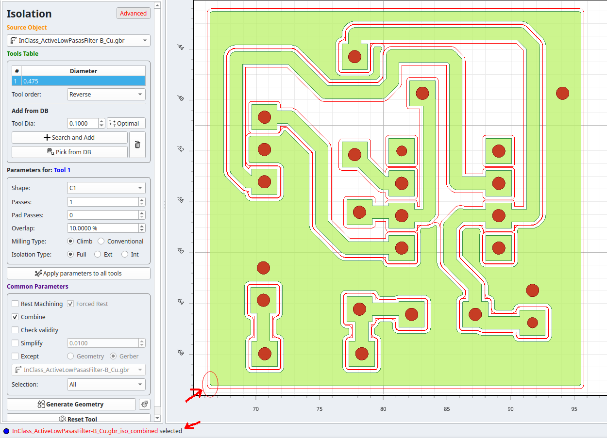
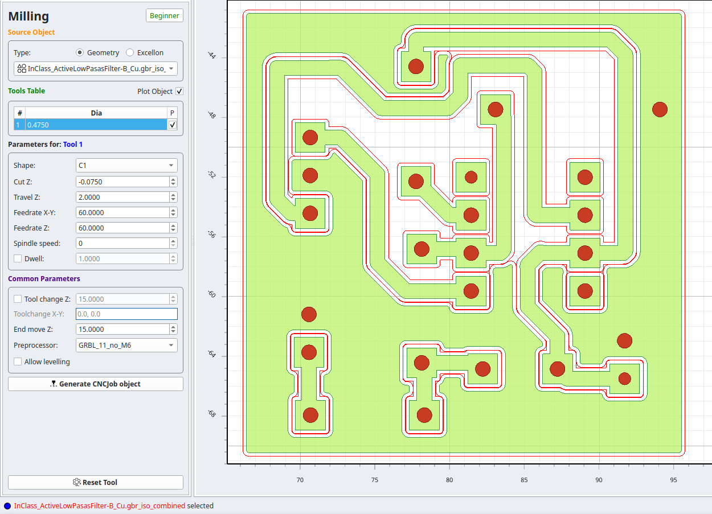
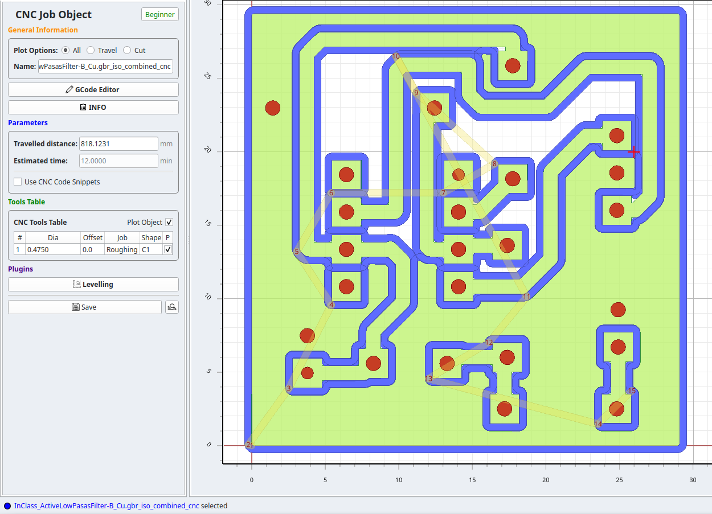
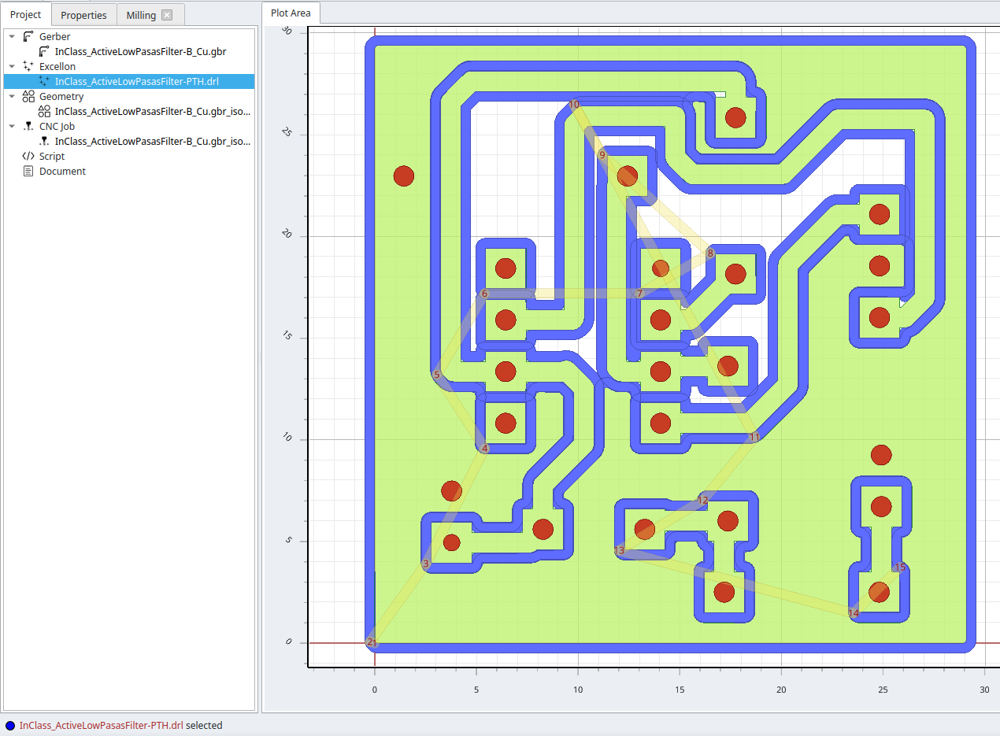
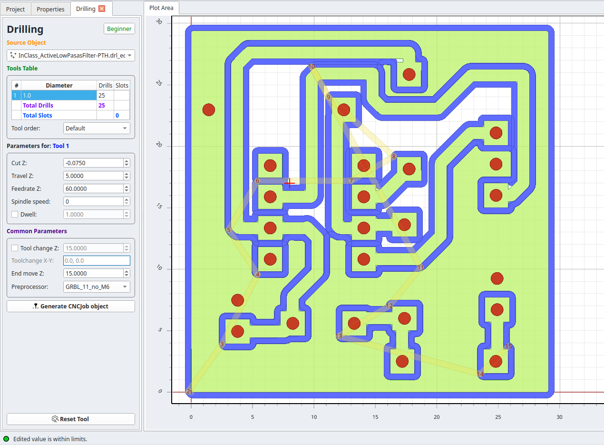

# FlatCAM Tips (for Genmitsu CNC 3018-PRO)

This section provides practical guidelines to reduce common **design and manufacturing issues** when milling PCBs designed in **KiCAD** using the **Genmitsu CNC 3018-PRO** CNC machine
([Amazon link](https://www.amazon.com/Genmitsu-3018-PRO-Control-Engraving-300x180x45mm/dp/B07P6K9BL3)).

  

The **Genmitsu CNC 3018-PRO** is an entry-level, desktop, 3-axis CNC router intended for hobbyists, students, and educational environments. It has a working area of approximately **300 × 180 × 45 mm**, uses a 775 spindle motor, and is controlled via **GRBL firmware**. The machine is commonly used for engraving and light milling of materials such as wood, plastics, acrylic, **PCB copper boards**, and soft aluminum. While affordable and relatively easy to assemble, it is designed for **prototyping and learning**, not industrial-grade PCB manufacturing.

Although the machine offers reasonable precision, PCB milling imposes strict constraints on **trace width, clearance, and pad size**. Inadequate values can easily result in short circuits, broken traces, or partially milled pads.

---

## FlatCAM Design Guidelines for CNC Milling

From KiCAD, two fabrication files must be generated:

- `'name'_B_Cu.gbr` — Gerber file containing the copper traces
- `'name'_PTH.drl` — Excellon drill file containing the hole locations

### Loading Files in FlatCAM

- Open **FlatCAM**
- Load the fabrication files:
  - `File → Open → Open Gerber` → select `'name'_B_Cu.gbr`
  - `File → Open → Open Excellon` → select `'name'_PTH.drl`

### Move the Board to the Origin

- Select all objects: **Ctrl + A**
- Go to `Edit → Move to Origin`

### Mirror the Board (Required for Bottom Layer)

- Select all objects: **Ctrl + A**
- Go to `Options → Flip on X-axis`

---

## Preparing the MILLING File from Gerber (`'name'_B_Cu.gbr`)

- Double-click the Gerber file in the project tree

  

- Open **Isolation Routing**
- Click **Beginner** to switch to **Advanced** mode
- Remove tool **#1 (Diameter)**
  *(Right-click → Delete)*

- Click **Pick from DB** to select a tool
- Open **Settings**
  - **Diameter:** `0.475 mm`
  - **Cut Z:** `-0.075 mm`

  

- Click the tool, then click **Transfer Tool**

  

- Click **Generate Geometry**

A confirmation message should appear in the bottom-left corner, and the generated toolpath should become visible:

  
  

---

## Generating the CNC Job (Milling)

- Select the **Milling** geometry object

  

- Configure the CNC job parameters:
  - **Cut Z:** `-0.075 mm`
    *(Depth of cut relative to the Z reference)*

  - **Travel Z:** `2.0 mm`
    *(Safe height when moving between cuts)*

  - **Postprocessor:** `GRBL_11_no_M6`

  

- Click **Generate CNC Job Object**

  

### Saving the File

- Save the CNC job file as:
  'name'_**MILLING_0.075**.nc

---

## Preparing the DRILLING Files from Excellon (`'name'_PTH.drl`)

### Drill Center Marking File

- Go to the **Project** tab
- Double-click the `.drl` file in the project tree

  

- Open **Excellon Editor**
- Change the diameter of **all holes** to `1.0 mm`
- Exit the editor → **Yes**
- Click **Drilling**
- **Settings**

  

- Click **Generate CNC Job Object**

### Saving the File

- Save the CNC job file as:
  'name'_**DRILLING_0.075**.nc

**Note:** This file is used **only to mark the center of the holes**.

---

### Drill Through-Hole File

- Go **BACK** to the **Project** tab
- Double-click the `.drl` file in the project tree

  

- Open **Excellon Editor**
- Change the diameter of **all holes** to `1.0 mm`
- Exit the editor → **Yes**
- Click **Drilling**
- Open **Settings**
  - Change **Cut Z** to `-2.5 mm`

  

- Click **Generate CNC Job Object**

### Saving the File

- Save the CNC job file as:
  'name'_**DRILLING_2.5**.nc

**Note:** This file is used to **fully drill the holes**.

---

## Generated G-code Files Summary

From FlatCAM, **three files** must be generated:

- 'name'_**MILLING_0.075**.nc
  — Used in **Candle** to mill the copper traces

- 'name'_**DRILLING_0.075**.nc
  — Used in **Candle** to mark the hole centers

- 'name'_**DRILLING_2.5**.nc
  — Used in **Candle** to drill the holes through the board
