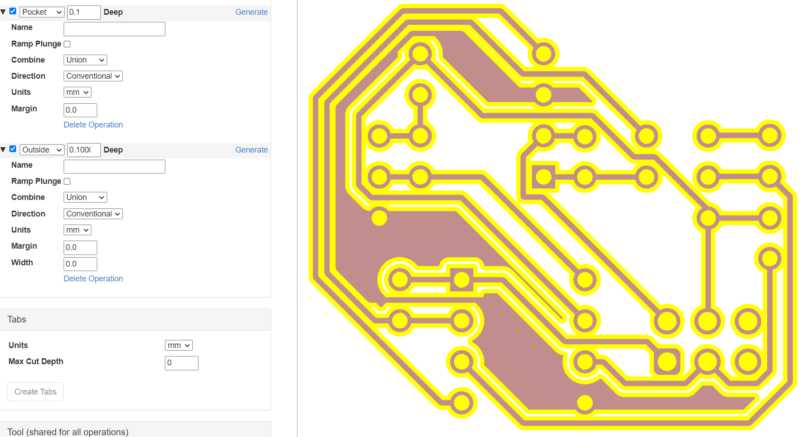

# Inkscape & jscut
Each SVG file can be opened in Inkscape to make these files compatible with jscut. This process is brief, and consists of converting all objects present in the SVG into path objects. Select all objects in the graphic area and select the "Path → Object to Path" menu option, followed by the "Path → Stroke to Path" menu option. Exporting this as an SVG with a transparent background is sufficient to progress to jscut. It is helpful to reduce the page size as well. Keybindings make the Inkscape process easy and fast:

"Ctrl + A" - Select all

"Shift + Ctrl + R" - Resize page to selection

"Shift + Ctrl + C" - Object to path conversion

"Ctrl + Alt + C" - Stroke to path conversion

"Ctrl + S" - Save SVG

  

jscut ingests an SVG file and allows configuring various types of toolpaths followed by export to Gcode. Since the PCB milling operation is a single pass at 0.1mm depth-of-cut (and potentially a second operation for pad and via holes), many settings are unused.

* It is recommended to select "Make all mm", set Tool Diameter to 0.1mm, set Pass Depth to 0.1mm, set Rapid to 1000mm/min, and set Plunge and Cut to 100mm/min, before moving on to Operations.

* Select "Open SVG → Local" to open the SVG file exported from Inkscape. If the copper layer graphic does not appear as expected, or appears incomplete or cut off, adjust Inkscape export settings accordingly.

* If all appears as expected, begin selecting path objects in the graphic to create Operations. Multiple Operations can be created per group of objects selected, for example, select all pad and via holes and select "Create Operation", followed by the "Pocket" drop-down option, and a value of "0.1" for the Deep field. The Operation can be expanded to access additional options, such as boolean operations, margin setting, and milling direction.

* After the Pocket Operation, select all copper objects such as pours, pads, vias, and traces (this may take some time with complex designs), then select "Create Operation", followed by the "Outside" drop-down option, and again a value of "0.1" for the Deep field. The Pocket and Outside Operations are sufficient for most designs using through-hole or even surface mount components, but there is potential for more advanced toolpathing as well.

* Select "Simulate GCODE" to verify toolpathing and observe Operation behavior and order.

* Select "Save GCODE" to save the Gcode file.

  

