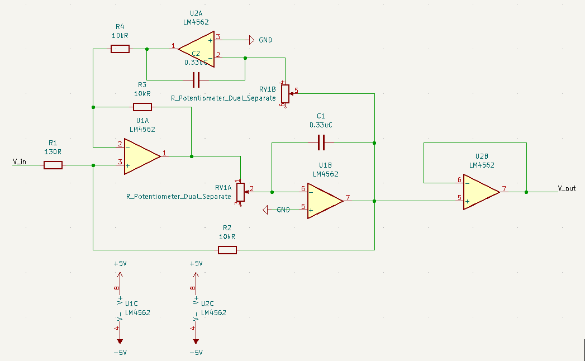

# Using KiCAD
Designs start in a KiCAD project. It is possible to start immediately within the PCB editor, however there are advantages to working within a project file and creating a schematic first.

The schematic editor looks and functions similarly to SPICE software, with usability improvements as well as functionality beneficial to full-stack design work. Components may be added to the KiCAD library, but the existing library is sufficient for intermediate designs. Components can be assigned a footprint, which also often includes a 3D model for rendering visuals and checking 3D space conflicts. Python script support extends functionality and allows for some automation, but is not necessary to produce competent results.

  

The PCB board editor can be entered from the schematic editor. The two documents are linked, and components in the schematic will be inserted into the board editor as footprints. Use the hotkey "F8" or select "Tools → Update PCB from Schematic", this will place missing footprints. Circuit nets are also shared between the documents. It is possible to auto-place footprints, but it is recommended to manually adjust and rotate components accordingly to make routing easier. The board editor has many layers to manipulate. Most important for prototyping purposes are the top copper layer and the edge cuts layer. The bottom layer and multiple layers beyond this are also accessible (board stackup settings may be edited at any time). Additional vias and PCB specific components that are not typically present on a circuit schematic can be placed in the same manner as in the schematic editor, with a large default library to explore. Pin headers, I/O vias and pads, connectors, and even active trace elements such as Bluetooth or tuned antennae are present and waiting for application in student projects!

  

Once a board design is ready to export, _the process will diverge depending on whether you are ingesting **gerber fabrication files with FlatCAM**, or **SVG files with Inkscape and jscut**. Both are effective for prototyping, though the SVG method tested poorly among students. If you opt to go this route, export your copper layer in color, select only the board area, and include edge cuts if you need those outlined in the milling operation. Otherwise, select "File → Fabrication Outputs → Gerbers" and select the layer you are working with. Default settings were found to work well. Select "Plot to create the Gerber file, and then select "Generate Drill Files" (being sure "Drill Units" is set to millimeters) to create the drill Excellon file. Default settings here were also found to work well. Several files are created, however we will only use two in FlatCAM.

Next Tutorial: [Using FlatCAM](./using_FlatCAM.md)
