# PCB_MFG
This repository was created for working with and improving the on-campus PCB design and production process using open-source software resources as well as physical resources and space provided by the University of Colorado Boulder and Colorado Mesa University Partnership Program on the Colorado Mesa University campus. These resources are made available to students and faculty alike.

## Introduction
PCB production is in the process of being made more accesible to students and faculty. Desktop CNC machines are available in labs at Confluence Hall which have the capacity to produce good quality single-sided designs, as well as double-sided designs (with some additional effort), with low/no cost for students and faculty. Efforts have been made to reduce complexity and improve ease-of-use by developing a consistent and repeatable process that produces usable results in a shorter time-frame than ordering from third-party prototyping services.

## Hardware Used
The CNC machines located in Confluence Hall labs are being made available for specific projects by faculty permission, and may be made more widely available in the future. Discuss access with faculty and ensure thorough understanding of the equipment, materials, and lab policies before use - you will gain valuable assistance and knowledge to improve your results and ensure that these resources remain effective and safe for use.

### Genmitsu 3018 Pro Desktop CNC Machines

A 3D-printable fixture which fits 100x70mm copper-clad boards is provided as an STL file in this repository. This was designed specifically for this CNC machine and this process. It provides an easy clamping method with consistent repeatability.

  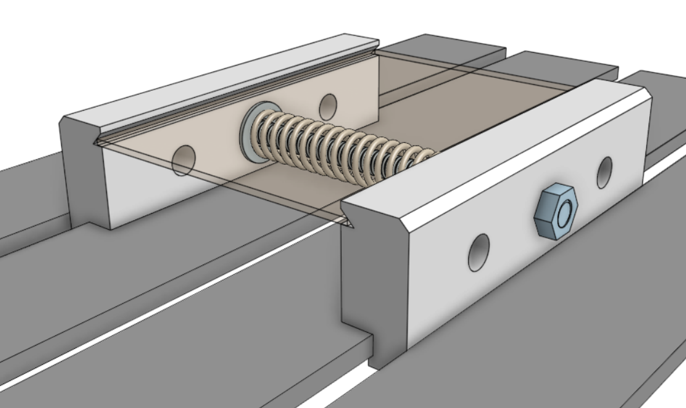

## Software Used
The following software is available on Github or their respective websites, and each were found to be effective for each part of the process detailed within this repository. System compatibility and ease-of-use were priorities, as was open-source status.

### https://github.com/Denvi/Candle CNC control and heightmapping software (Windows or Linux)

### https://bitbucket.org/jpcgt/flatcam/src/master (http://flatcam.org) Gerber & Excellon intake, toolpathing, and Gcode output (Windows, Linux, MacOSX) **_comprehensive alternative to Inkscape & JScut_**

### https://github.com/KiCad (https://gitlab.com/kicad) Schematic & PCB design software, simulation, Gerber & SVG output (Docker, Windows, Linux, MacOSX)

Originally, Inkscape and JScut were used to create Gcode files using SVGs, rather than Gerber files. This tested poorly among students, so FlatCAM is preferred, but this process is retained below the current process for posterity.
##### https://github.com/tbfleming/jscut (https://jscut.org) SVG intake, toolpathing, and GCode output (in-browser)

##### https://github.com/inkscape/inkscape SVG preparation for JSCut (Windows, Linux, MacOSX)

## Process
It is recommended to have access to the above software. As they have their own release channels please refer to their documentation. Generally, Candle, Flatcam, and KiCAD are installed software. Arch Linux users are recommended to install `candle-bin` and `flatcam-git` from the AUR using `yay`, while KiCAD is available using `pacman -Syu kicad` and KiCAD libraries using `pacman -Syu --asdeps kicad-library kicad-library-3d`. Drivers for the 3018 CNC machine may need to be installed for communication through Candle, these may be found on the Sainsmart site.

  
KiCAD

Designs start in a KiCAD project. It is possible to start immediately within the PCB editor, however there are advantages to working within a project file and creating a schematic first.

The schematic editor looks and functions similarly to SPICE software, with usability improvements as well as functionality beneficial to full-stack design work. Components may be added to the KiCAD library, but the existing library is sufficient for intermediate designs. Components can be assigned a footprint, which also often includes a 3D model for rendering visuals and checking 3D space conflicts. Python script support extends functionality and allows for some automation, but is not necessary to produce competent results.

  

The PCB board editor can be entered from the schematic editor. The two documents are linked, and components in the schematic will be inserted into the board editor as footprints. Use the hotkey "F8" or select "Tools → Update PCB from Schematic", this will place missing footprints. Circuit nets are also shared between the documents. It is possible to auto-place footprints, but it is recommended to manually adjust and rotate components accordingly to make routing easier. The board editor has many layers to manipulate. Most important for prototyping purposes are the top copper layer and the edge cuts layer. The bottom layer and multiple layers beyond this are also accessible (board stackup settings may be edited at any time). Additional vias and PCB specific components that are not typically present on a circuit schematic can be placed in the same manner as in the schematic editor, with a large default library to explore. Pin headers, I/O vias and pads, connectors, and even active trace elements such as Bluetooth or tuned antennae are present and waiting for application in student projects!

  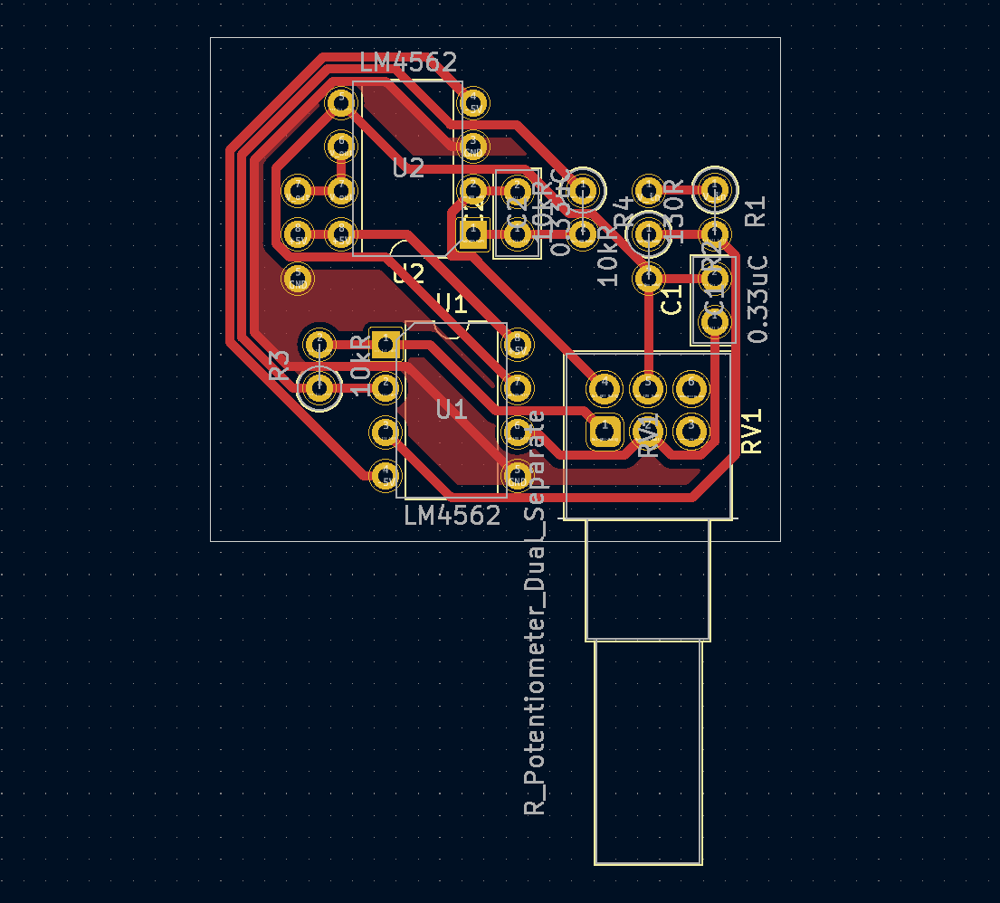

Once a board design is ready to export, _the process will diverge depending on whether you are ingesting **gerber fabrication files with Flatcam**, or **SVG files with Inkscape and JScut**_. Both are effective for prototyping, though the SVG method tested poorly among students. If you opt to go this route, export your copper layer in color, select only the board area, and include edge cuts if you need those outlined in the milling operation. Otherwise, select "File → Fabrication Outputs → Gerbers" and select the layer you are working with. Default settings were found to work well. Select "Plot to create the Gerber file, and then select "Generate Drill Files" to create the drill Excellon file. Default settings here were also found to work well. Several files are created, however we will only use two in FlatCAM.

  
FlatCAM

•  In FlatCAM, open the Gerber and the Excellon files to add them to the FlatCAM project.

  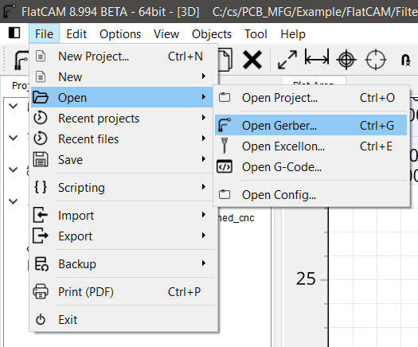

  
•  These objects may be placed far from the origin, so select all using the "Ctrl + A" shortcut, and Move to Origin using the "Shift + O" shortcut. It is important to select all objects to move them as a group, otherwise the drill objects will not be aligned to the contour objects.

  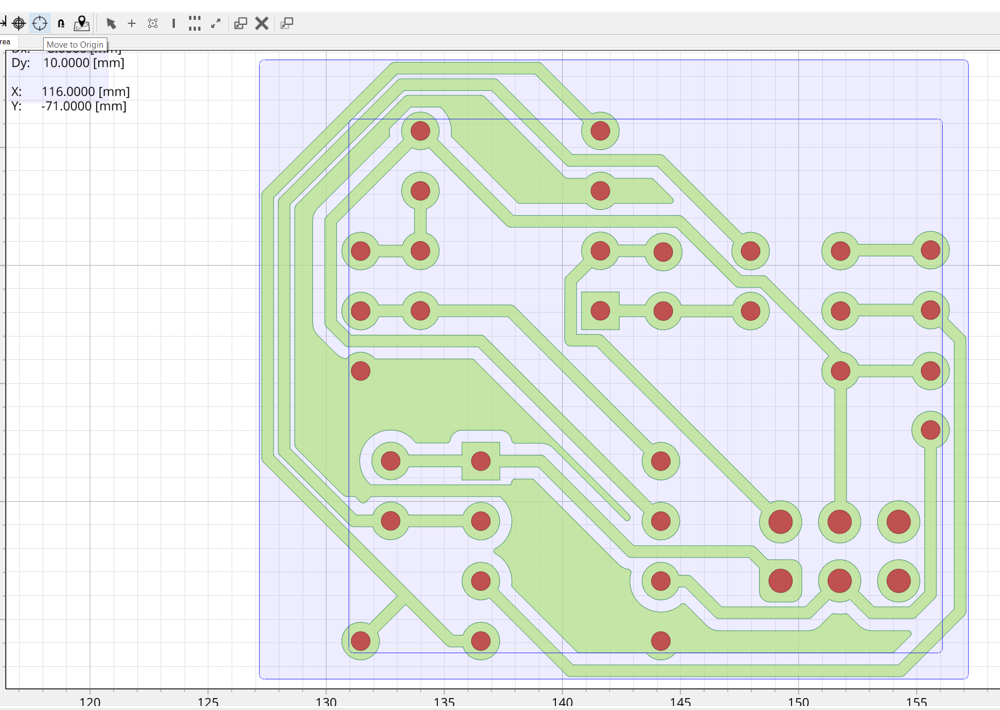

•  Double-click the Gerber in the project tree side panel, then select "Isolation Routing".

  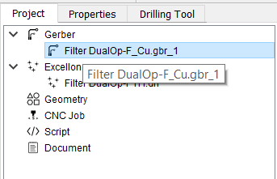

•  Right click the #1 tool in the Tools Table and delete it. We must set up a new tool to mill at the 0.1mm depth of cut using the lab's V-cutter bits.

•  Use the "Ctrl + D" shortcut to open the Tools Database. You may create a new tool here, but it is recommended to import the database provided in this repository. Select "Import DB" and select the "V-Cutter 20deg 3.175mm.TXT" file to import the V-cutter tool.

•  Select "Pick from DB" in the sidebar, select the "V-Cutter" tool, and select "Transfer the Tool" to apply to the Isolation Tool operation.

•  Change "Tool Dia." to match the 0.0354 diameter, and select "Generate Geometry", followed by "Generate CNCJob Object".

•  The contour job is complete, select "Save CNC Code" or right click the CNC Job in the project tree side panel to save the Gcode for access with Candle later.

•  The drill job can now be created. This operation may vary depending on your requirements. For example, the provided design uses two different size vias, and these can either be combined to one size or retained as two different drill operations. Depending on drill bit availability and prototyping requirements, you may opt to simplify this operation to use the smallest size drill, otherwise it is recommended to use the Tool Change option to provide for drill changing.

•  Double click the Excellon drill file in the project tree side panel, and select "Excellon Editor" to make changes to the drills this operation will apply to. For example, edit all sizes to the same value to combine drills.

  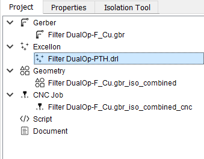

  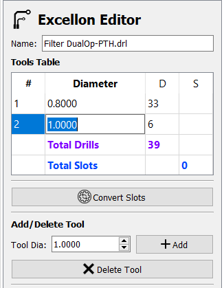

•  Exit the editor and save changes. Select "Drilling Tool" and edit parameters accordingly. Since this is a separate operation from the contour, it will be critical that the CNC machine retains its positioning to ensure alignment. Keep this in mind when setting parameters for tool changes, if this option is selected.

•  It is recommended to reduce Feedrate Z to 60 (300 may be too high and could cause damage to the board). Adjust Cut Z to a value that will completely drill through the board. If using the provided fixture, there will be ample clearance under the board.

•  Select "Generate CNCJob Object" and save in the same manner as the contour operation.

  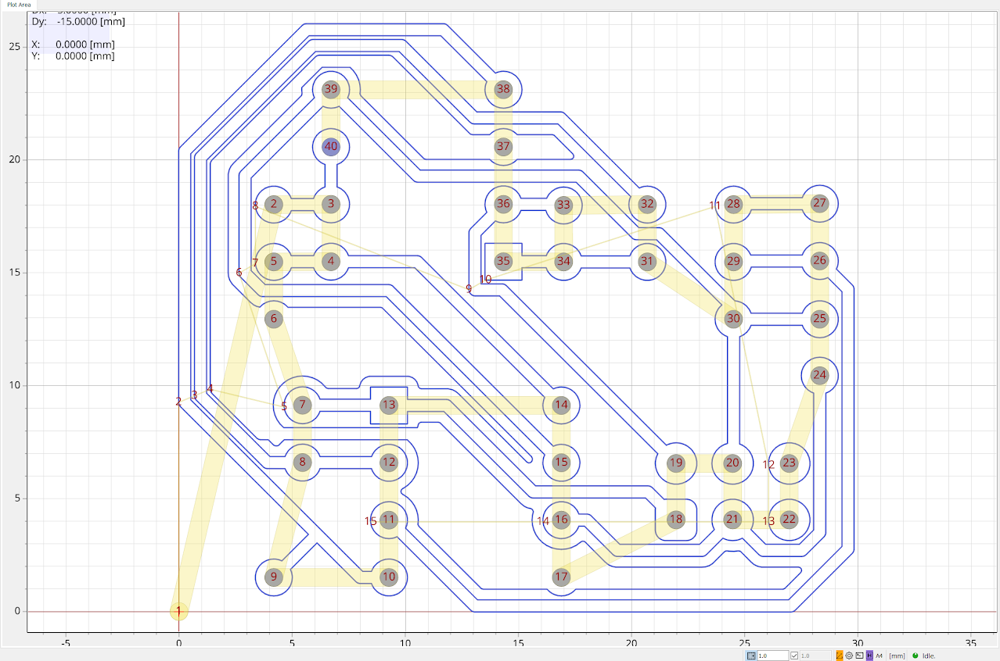

These Gcode files may be opened directly in Candle for heightmap generation and running the machine.

  
Candle

Candle controls the CNC machine directly over USB or by generating a Gcode file for running on a USB stick inserted in the CNC machine.

•  Ensure Candle is connected to the CNC machine over USB by selecting "Service → Settings" and "Connection" in the pop-up window. The "Connection" drop-down should show a numbered COM option corresponding to the CNC machine - if not, verify the correct drivers have been installed.

•  Close this window and observe the control panel, which may be configured by adjusting settings.
The 3018 Pro CNC machine is capable of making use of the probe and heightmap functions in Candle, which are critical to producing good quality PCB designs.

•  In order to use the continuity probe, where the cutting tool making contact with the PCB surface triggers the probe stop, GRBL commands must be sent to the machine via the command terminal, and the tool head spindle must be connected to a "GND" pin on the control board, and the PCB must be connected to the "A5" pin on the control board. Some 3018 Pro machines shipped with different labelling on the control board - the pins may also be labeled "probe". Both types of control boards are present in the campus labs, so please be aware of this if you use different machines. These connections are easily made using alligator clips and pin headers. These connections must be removed when turning the spindle on - **be sure to always check and check again that these clips are removed from the spindle before turning the spindle on**.

•  The GRBL commands that must be sent to properly set the homing cycle for continuity probing are `$22=1` (homing cycle enable) and `$23=0` (homing cycle direction). Additional GRBL commands are provided in the "GRBL_Settings_Pocket_Guide_Rev_B" document or at www.DIYMachining.com/GRBL.

•  With the homing cycle configured, spindle off, and clips attached, use the control panel to raise the tool head and position the cutting tool over a corner of the PCB. Note the directionality of all controls, and observe the Candle graphical display of the tool head.

•  The Z-home button may be used to slowly lower the tool head until continuity is made and the tool head stops. Zero the machine in Candle by selecting the Zero X, Y, and Z buttons in the control panel.

•  Load the Gcode file generated by FlatCAM by selecting "File → Open". Select the contour CNC job.

  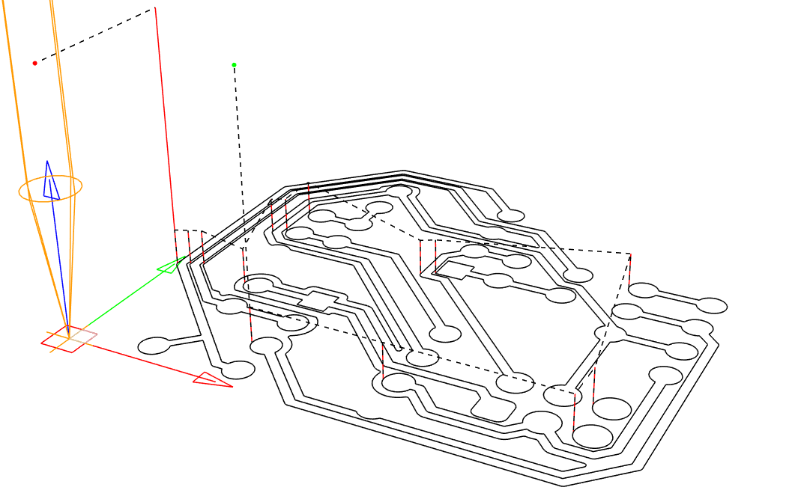

•  Once a Gcode file is opened, Candle enables the Heightmap function. Select "Create" (or optionally apply the modeled heightmap that was developed for rapid prototyping using the fixture design included in this repository).

•  Adjust the Heightmap settings to enclose the design shown in the graphical window, or select the "Auto" button to automatically set parameters.

•  Select reasonable values for the Heightmap Probe Grid. Some parameters may be unfamiliar - "F" is the probe feedrate, "Zt" is the distance to raise the tool head when moving to the next point, and "Zb" is the distance to lower the tool head when probing. If the machine was zeroed previously, then a value of 1.50 for Zt with other values left as default is likely sufficient.

•  Observe the arrangement of the graphical representation of the operation and visually verify that the machine will not crash before selecting "Probe". The routine will run until complete or stop if continuity was made at an unexpected point. If the Heightmap was not able to be completed, try adjusting the "Zt" or "Zb" parameters accordingly, or inspect for other issues, before trying again.

  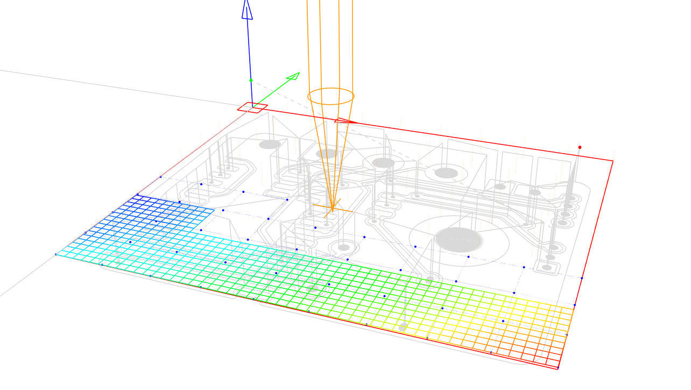

•  With the Heightmap complete, close the Heightmap mode by selecting "Edit", and select the checkbox "Use Heightmap".

•  Raise the tool head slightly and reset alarms if necessary.

•  Perform additional visual checks to verify the machine will be able to proceed with the milling operation unobstructed, and **remove clips attached to the spindle and PCB before turning the spindle on**.
### Note that the spindle rotates near 10,000 RPM, and the cutting bit could break and create a dangerous situation. Follow lab policies regarding safety and have faculty or senior students familiar with this process verify that everything is in order before turning on the spindle and running milling Gcode.

•  Turn the spindle on and select "Send" to run the operation. Observe the machine safely and while wearing safety glasses.

•  The routine should complete and the PCB will be ready for hole drilling operations. Hole drilling operations should be completed without changing the machine zero positioning, or else alignment will be difficult to achieve accurately. The hole drilling operation should be straightforward so long as the tool bit is changed without losing the machine positioning.

  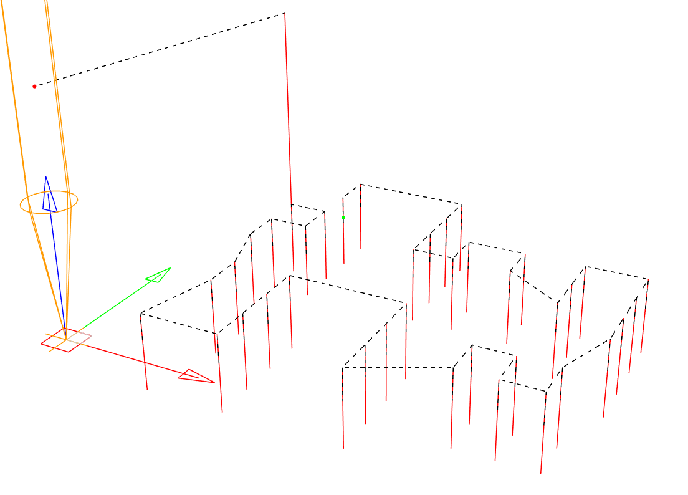

The routine should complete and the PCB will be ready for final processing or cutting operations.

  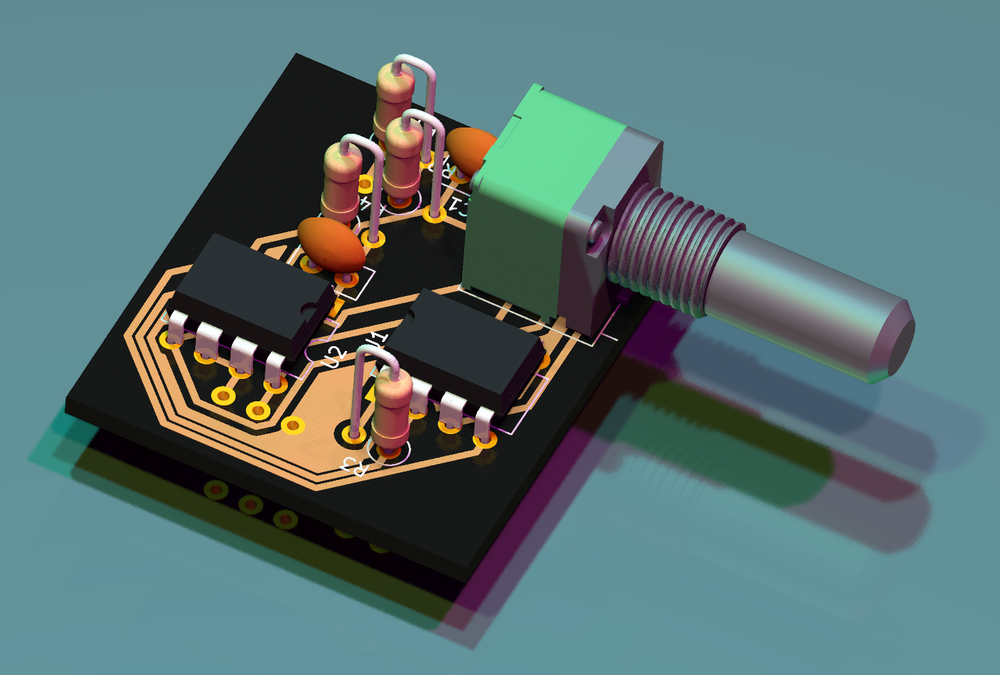

Originally, Inkscape and JScut were used to create Gcode files using SVGs, rather than Gerber files. This tested poorly among students, so FlatCAM is preferred, but this process is retained here for posterity.

  
Inkscape & JScut

Each SVG file can be opened in Inkscape to make these files compatible with JScut. This process is brief, and consists of converting all objects present in the SVG into path objects. Select all objects in the graphic area and select the "Path → Object to Path" menu option, followed by the "Path → Stroke to Path" menu option. Exporting this as an SVG with a transparent background is sufficient to progress to JScut. It is helpful to reduce the page size as well. Keybindings make the Inkscape process easy and fast:

"Ctrl + A" - Select all

"Shift + Ctrl + R" - Resize page to selection

"Shift + Ctrl + C" - Object to path conversion

"Ctrl + Alt + C" - Stroke to path conversion

"Ctrl + S" - Save SVG

  

JScut ingests an SVG file and allows configuring various types of toolpaths followed by export to Gcode. Since the PCB milling operation is a single pass at 0.1mm depth-of-cut (and potentially a second operation for pad and via holes), many settings are unused.

•  It is recommended to select "Make all mm", set Tool Diameter to 0.1mm, set Pass Depth to 0.1mm, set Rapid to 1000mm/min, and set Plunge and Cut to 100mm/min, before moving on to Operations.

•  Select "Open SVG → Local" to open the SVG file exported from Inkscape. If the copper layer graphic does not appear as expected, or appears incomplete or cut off, adjust Inkscape export settings accordingly.

•  If all appears as expected, begin selecting path objects in the graphic to create Operations. Multiple Operations can be created per group of objects selected, for example, select all pad and via holes and select "Create Operation", followed by the "Pocket" drop-down option, and a value of "0.1" for the Deep field. The Operation can be expanded to access additional options, such as boolean operations, margin setting, and milling direction.

•  After the Pocket Operation, select all copper objects such as pours, pads, vias, and traces (this may take some time with complex designs), then select "Create Operation", followed by the "Outside" drop-down option, and again a value of "0.1" for the Deep field. The Pocket and Outside Operations are sufficient for most designs using through-hole or even surface mount components, but there is potential for more advanced toolpathing as well.

•  Select "Simulate GCODE" to verify toolpathing and observe Operation behavior and order.

•  Select "Save GCODE" to save the Gcode file.

  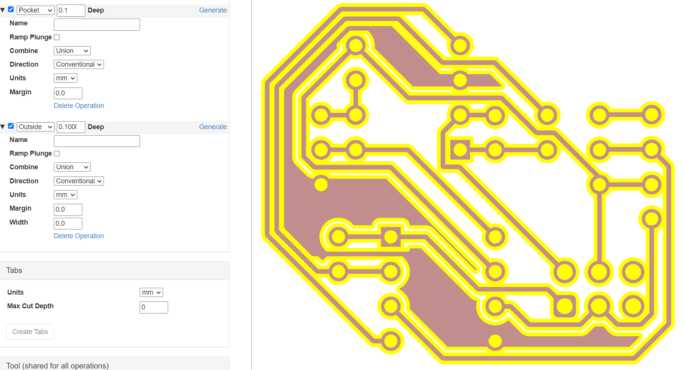

## Heightmap Modelling
As a Fall 2023 Intro to Probability Theory final project, a dataset was built from Candle heightmaps and various conclusions were drawn from observations and analysis of this data. Data was interpreted using the MATLAB scripts included in this repository. The resultant report and supporting materials are included in [Reports](/Reports/).

The resultant model heightmap, which is based on the mean data, will be made available after the conclusion of the Fall 2023 semester.

In the future, other students and faculty will have the opportunity to contribute to the dataset and assist in refining the model.
