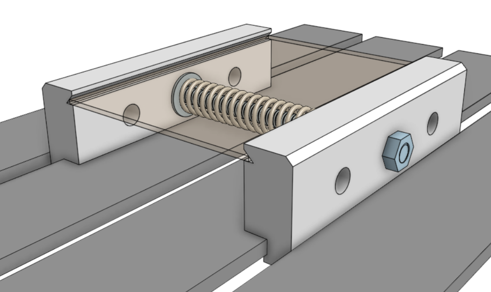

# PCB_MFG

This repository was created for working with and improving the on-campus PCB design and production process using open-source software resources as well as physical resources and space provided by the University of Colorado Boulder and Colorado Mesa University Partnership Program on the Colorado Mesa University campus. These resources are made available to students and faculty alike.

## Introduction

PCB production is in the process of being made more accessible to students and faculty. Desktop CNC machines are available in labs at Confluence Hall which have the capacity to produce good quality single-sided designs, as well as double-sided designs (with some additional effort), with low/no cost for students and faculty. Efforts have been made to reduce complexity and improve ease-of-use by developing a consistent and repeatable process that produces usable results in a shorter time-frame than ordering from third-party prototyping services.

## Participation

Student and faculty participation in this repository is encouraged! Please check the  and <a href="../../issues">Issues</a> pages to learn about proposed changes and additions. Your engagement in development of this process is welcome. Feedback is also appreciated!
A great way to get started with new commits is to fork this repository, make your changes, and create a pull request to merge changes back into the main branch (pending approval). [Workflow actions](https://github.com/Jbsco/PCB_MFG/actions) are enabled to help enforce spell checking, this uses the [Check-Spelling](https://github.com/marketplace/actions/check-spelling) action.

## Hardware Used

The CNC machines located in Confluence Hall labs are being made available for specific projects by faculty permission, and may be made more widely available in the future. Discuss access with faculty and ensure thorough understanding of the equipment, materials, and lab policies before use - you will gain valuable assistance and knowledge to improve your results and ensure that these resources remain effective and safe for use.

### Genmitsu 3018 Pro Desktop CNC Machines

A 3D-printable fixture which fits 100x70mm copper-clad boards is provided as an STL file in this repository. This was designed specifically for this CNC machine and this process. It provides an easy clamping method with consistent repeatability.

  

## Software Used

The following software is available on GitHub or their respective web sites, and each were found to be effective for each part of the process detailed within this repository. System compatibility and ease-of-use were priorities, as was open-source status.

* [**Candle**: CNC control and heightmapping software (Windows or Linux)](https://github.com/Denvi/Candle)

* **FlatCAM**: Gerber & Excellon intake, toolpathing, and Gcode output (Windows, Linux, MacOSX) ***comprehensive alternative to Inkscape & jscut***
  * [FlatCAM BitBucket](https://bitbucket.org/jpcgt/flatcam/src/master)
  * [FlatCAM Docs](http://flatcam.org)

* **KiCAD**: Schematic & PCB design software, simulation, Gerber & SVG output (Docker, Windows, Linux, MacOSX)
  * [KiCAD GitHub](https://github.com/KiCad)
  * [KiCAD GitLab](https://gitlab.com/kicad)

Originally, Inkscape and jscut were used to create Gcode files using SVGs, rather than Gerber files. This tested poorly among students, so FlatCAM is preferred, but this process is retained below the current process for posterity.

* **jscut**: SVG intake, toolpathing, and GCode output (in-browser)[
  * [jscut GitHub](https://github.com/tbfleming/jscut)
  * [jscut](https://jscut.org) 
* [**Inkscape**: SVG preparation for jscut (Windows, Linux, MacOSX) ](https://github.com/inkscape/inkscape)

## Process

It is recommended to have access to the above software. As they have their own release channels please refer to their documentation. Generally, Candle, FlatCAM, and KiCAD are installed software, and releases are available from their respective sites. Linux installs for common distributions are often available.

Arch Linux users are recommended to install `candle-bin` from the AUR using `yay`, while FlatCAM runs from source using `python FlatCAM.py` after installing dependencies (`python-vispy` 0.7 or lower is needed. FlatCAM can also be installed as `flatcam-git` from the AUR using `yay`, but the dependency `python-svg.path` may need to be installed with the `--mflags "--nocheck"` flags in order to bypass failed tests), and KiCAD is available using `pacman -Syu kicad` and KiCAD libraries using `pacman -Syu --asdeps kicad-library kicad-library-3d`.

Drivers for the 3018 CNC machine may need to be installed for communication through Candle, these may be found on the Sainsmart site.

Additional documentation (including general usage guides, tips, and tricks) for each application used in this process will be linked within this repo.

## Tutorials

* [Using KiCAD](Documentation/using_KiCAD.md)
* [Using FlatCAM](Documentation/using_FlatCAM.md)
* [Using Candle](Documentation/using_Candle.md)

Originally, Inkscape and jscut were used to create Gcode files using SVGs, rather than Gerber files. This tested poorly among students, so FlatCAM is preferred, but this process is retained here for posterity.

* [Using Inkscape and jscut](Documentation/using_Inkscape_JSCut.md)

## Heightmap Modeling
As a Fall 2023 Intro to Probability Theory final project, a dataset was built from Candle heightmaps and various conclusions were drawn from observations and analysis of this data. Data was interpreted using the MATLAB scripts included in this repository. The resultant report and supporting materials are included in [Reports](/Reports/).

The resultant model heightmap, which is based on the mean data, is available at [/Reports/Code/bootModel.map](/Reports/Code/bootModel.map). This heightmap may prove more useful as the dataset grows.

In the future, other students and faculty will have the opportunity to contribute to the dataset and assist in refining the model.
